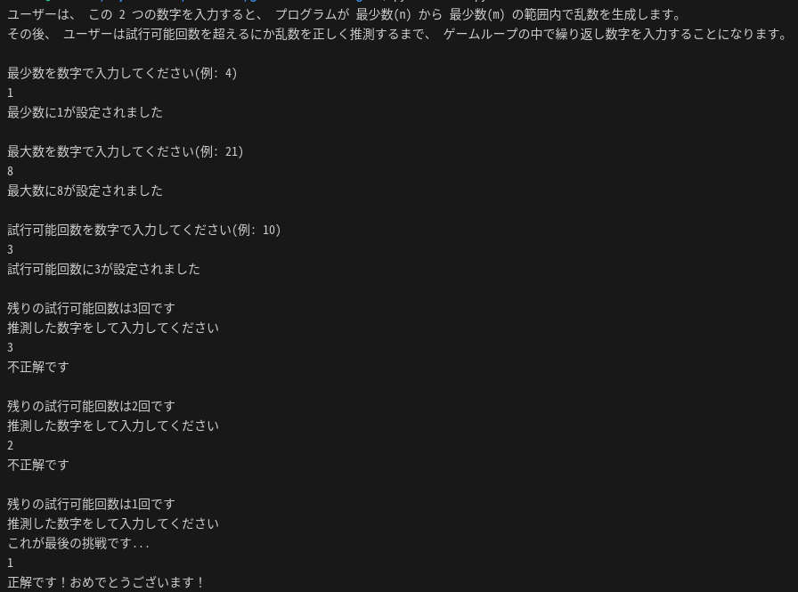

# guess-the-number-game
対話形式の数字当てゲームです。

## 使用技術
言語: Python

## 起動方法
$ ls
> ${PROJECT_PARENT_DIRECTORY_PATH}/guess-the-number-game

$ python3 main.py

## ルール
最少数と最大数を指定すると、その範囲内でランダムな数字が生成されます。  
そのランダムな数字を試行回数以内に当てるゲームです。  
ゲームはターミナル上で行われます。

## 遊び方
### 1. 最少数(n)を決める
入力した値が数字でない場合は、再度要求されます。

### 2. 最大数(m)を決める
入力した値が数字でない場合は、再度要求されます。

### 3. 試行回数を決める
入力した値が数字でない場合は、再度要求されます。

### 4. 数字を当てる
試行回数以内に数字を当てればゲームクリアです。  
残りの試行回数が表示されます。  
最後の試行時には、その旨が表示されます。

## 遊び方の例 

